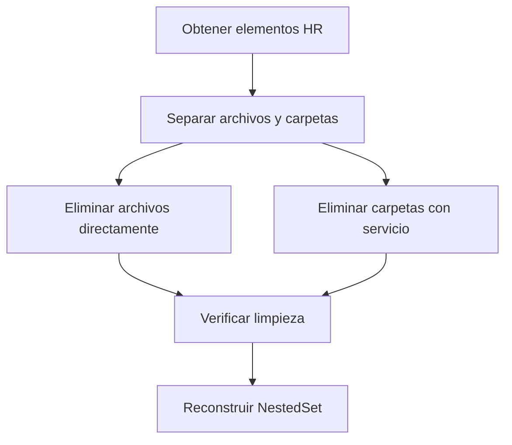

# 🔧 Actualización: Manejo Correcto de Archivos y Carpetas en Limpieza

## 📋 Hallazgo Importante

Al revisar el código de los servicios, descubrí que:

### ❌ Suposición Inicial Incorrecta
**Lo que pensábamos:** `DirectoryManagementService::deleteDirectory()` maneja tanto archivos como carpetas internamente.

### ✅ Realidad del Código
**Lo que realmente ocurre:** Los servicios están especializados:

```php
// DirectoryManagementService::deleteDirectory()
public function deleteDirectory(Folder $folder, bool $forceDelete = false): bool {
    if (!$folder->esCarpeta()) {
        throw new \InvalidArgumentException('El elemento debe ser una carpeta');
    }
    // ... solo maneja carpetas
}

// FolderService::deleteFolder() 
public function deleteFolder(Folder $folder, bool $forceDelete = false): bool {
    if (!$folder->esCarpeta()) {
        throw new \InvalidArgumentException('El nodo a eliminar debe ser una carpeta');
    }
    // ... también solo maneja carpetas
}
```

## 🛠️ Solución Implementada

### Enfoque Híbrido Correcto

```php
protected function cleanHRStructure(): void 
{
    // 1. Obtener todos los elementos HR
    $elementosHR = Folder::where('path', 'LIKE', 'hr%')->get();
    
    // 2. Separar por tipo
    $archivos = $elementosHR->filter(fn($item) => $item->esArchivo());
    $carpetas = $elementosHR->filter(fn($item) => $item->esCarpeta());
    
    // 3. Eliminar archivos directamente (sin servicios especializados)
    foreach ($archivos as $archivo) {
        $archivo->forceDelete();
    }
    
    // 4. Eliminar carpetas usando DirectoryManagementService
    foreach ($carpetas as $carpeta) {
        $this->directoryService->deleteDirectory($carpeta, true);
    }
}
```

## 🔍 Análisis de la Arquitectura

### Servicios Especializados

1. **DirectoryManagementService**
   - ✅ Maneja carpetas únicamente
   - ✅ Operaciones atómicas (lógica + física)
   - ✅ Eventos automáticos
   - ❌ No maneja archivos

2. **FolderService** 
   - ✅ Maneja carpetas únicamente  
   - ✅ Gestión de estructura NestedSet
   - ✅ Validaciones robustas
   - ❌ No maneja archivos

3. **FileSystemService**
   - ✅ Maneja operaciones físicas
   - ✅ Tanto archivos como carpetas
   - ❌ Solo operaciones físicas (no lógicas)

### Manejo de Archivos

Para archivos, las opciones son:

1. **Eliminación directa** (modelo)
   ```php
   $archivo->delete();        // Soft delete
   $archivo->forceDelete();   // Hard delete
   ```

2. **FileSystemService** (solo físico)
   ```php
   $this->fileSystemService->deleteFile($archivo);
   ```

3. **Servicio específico de archivos** (no existe actualmente)

## ✅ Decisión de Diseño Final

### Enfoque Adoptado
- **Archivos**: Eliminación directa via modelo (`$archivo->forceDelete()`)
- **Carpetas**: Uso de `DirectoryManagementService::deleteDirectory()`

### Justificación
1. **Consistencia**: Cada tipo usa su método más apropiado
2. **Eficiencia**: No hay overhead de servicios para operaciones simples de archivos
3. **Robustez**: Fallback a eliminación directa para carpetas si falla el servicio
4. **Claridad**: Código explícito sobre qué tipo se está manejando

## 🔄 Flujo de Eliminación Actualizado



### Detalles del Proceso

1. **Consulta unificada**: `WHERE path LIKE 'hr%'`
2. **Separación por tipo**: Usando `esArchivo()` y `esCarpeta()`
3. **Eliminación diferenciada**:
   - Archivos: `forceDelete()` directo
   - Carpetas: `directoryService->deleteDirectory()`
4. **Fallbacks robustos**: Si falla servicio → eliminación directa
5. **Verificación**: Confirmar que no quedan elementos
6. **Reconstrucción**: NestedSet íntegro

## 📊 Ventajas del Enfoque Híbrido

### ✅ Beneficios
- **Performance**: Eliminación directa para archivos (más rápida)
- **Consistencia**: Servicios especializados para carpetas
- **Robustez**: Múltiples fallbacks
- **Logging**: Información detallada por tipo
- **Mantenibilidad**: Código claro y explicativo

### ⚖️ Trade-offs Aceptables
- **Duplicación**: Dos métodos de eliminación diferentes
- **Complejidad**: Lógica de separación adicional
- **Eventos**: Los archivos no disparan eventos automáticos

## 🧪 Testing del Enfoque

### Escenario de Prueba
```sql
-- Datos de prueba
INSERT INTO folders (path, tipo_fichero_id) VALUES 
('hr', 1),                              -- Carpeta raíz
('hr/Empresas', 1),                     -- Carpeta empresa
('hr/Empleados/12345678A', 1),          -- Carpeta empleado  
('hr/Empleados/12345678A/archivo.pdf', 2); -- Archivo
```

### Resultado Esperado
```
1. Encontrados 4 elementos HR
2. Desglose: 1 archivos, 3 carpetas
3. Eliminando archivo: hr/Empleados/12345678A/archivo.pdf
4. Eliminando carpeta: hr/Empleados/12345678A
5. Eliminando carpeta: hr/Empresas  
6. Eliminando carpeta: hr
7. Elementos HR eliminados exitosamente
8. Verificación: 0 elementos restantes
```

## 📈 Conclusión

El enfoque híbrido es la solución correcta porque:

1. **Respeta la arquitectura**: Usa servicios donde están diseñados
2. **Es eficiente**: No fuerza operaciones innecesarias
3. **Es robusto**: Múltiples niveles de fallback
4. **Es mantenible**: Código claro y bien documentado

**El seeder ahora maneja correctamente la eliminación diferenciada de archivos y carpetas en estructura plana.** ✅
