# Documentación: Comando para Crear Contratos de Prueba

## Descripción General

El comando `contratos:crear-pruebas` facilita la generación de contratos con fechas de vencimiento específicas para probar el sistema de notificaciones de vencimiento de contratos. Este comando es especialmente útil para verificar que los eventos, listeners y notificaciones relacionados con los contratos funcionan correctamente.

## Uso Básico

```bash
# Crear un contrato que vence hoy
php artisan contratos:crear-pruebas --vence-hoy

# Crear un contrato que vence en 3 días (valor por defecto)
php artisan contratos:crear-pruebas --vence-pronto

# Crear un contrato que vence en 7 días
php artisan contratos:crear-pruebas --vence-pronto=7

# Crear un contrato que venció hace 5 días (valor por defecto)
php artisan contratos:crear-pruebas --vence-pasado

# Crear un contrato que venció hace 10 días
php artisan contratos:crear-pruebas --vence-pasado=10

# Crear todos los tipos de contratos de prueba
php artisan contratos:crear-pruebas --vence-hoy --vence-pronto=3 --vence-pasado=5
```

## Parámetros del Comando

| Opción             | Descripción                                   | Valor por defecto |
|--------------------|-----------------------------------------------|-------------------|
| `--vence-hoy`      | Crear un contrato que vence hoy              | N/A (bandera)     |
| `--vence-pronto=X` | Crear un contrato que vence en X días         | 3 días            |
| `--vence-pasado=X` | Crear un contrato que venció hace X días      | 5 días            |

## Características Técnicas

### 1. Detección Automática de Columnas

El comando utiliza `Schema::getColumnListing('contratos')` para detectar dinámicamente todas las columnas disponibles en la tabla de contratos. Esto asegura que el comando siga funcionando incluso si la estructura de la tabla cambia.

### 2. Verificación de Modelos Relacionados

Antes de crear contratos, el comando verifica la existencia de registros en las tablas relacionadas:
- Empleados
- Tipos de Contrato
- Departamentos
- Centros
- Jornadas

### 3. Manejo Inteligente de Errores

Si al intentar guardar un contrato se produce un error por la falta de un campo obligatorio, el comando:
1. Detecta el campo faltante mediante análisis del mensaje de error
2. Intenta crear automáticamente un valor válido para ese campo
3. Vuelve a intentar guardar el contrato

### 4. Método `crearValorParaCampoFaltante`

Este método es responsable de resolver dinámicamente los campos obligatorios faltantes:

```php
private function crearValorParaCampoFaltante(Contrato $contrato, string $campoFaltante): void
{
    switch ($campoFaltante) {
        case 'asignacion_id':
            // Obtener o crear una asignación
            break;
        case 'empresa_id':
            // Obtener o crear una empresa
            break;
        // Otros casos según sea necesario
    }
}
```

## Flujo de Ejecución

```mermaid
sequenceDiagram
    participant Command as CrearContratosPruebaCommand
    participant DB as Base de Datos
    participant Schema as Schema Facade
    participant Model as Modelos (Contrato, etc.)
    
    Command->>Schema: Obtener columnas de contratos
    Schema-->>Command: Lista de columnas
    Command->>DB: Verificar existencia de modelos relacionados
    DB-->>Command: Confirmación
    
    alt Crear contrato que vence hoy
        Command->>Model: Crear contrato (fecha_fin = hoy)
    end
    
    alt Crear contrato que vence pronto
        Command->>Model: Crear contrato (fecha_fin = hoy + X días)
    end
    
    alt Crear contrato que ya venció
        Command->>Model: Crear contrato (fecha_fin = hoy - X días)
    end
    
    alt Error: campo obligatorio faltante
        Model-->>Command: Error constraint violation
        Command->>Command: Detectar campo faltante
        Command->>DB: Crear/obtener valor para campo faltante
        Command->>Model: Reintentar guardar contrato
    end
    
    Model-->>Command: Contrato guardado exitosamente
    Command->>Command: Mostrar información del contrato creado
```



## Pruebas y Verificación

Después de crear contratos de prueba, se recomienda ejecutar el comando de verificación para comprobar que el sistema detecta correctamente los contratos vencidos o próximos a vencer:

```bash
# Verificar todos los contratos
php artisan contratos:verificar

# Verificar solo contratos vencidos
php artisan contratos:verificar --solo-vencidos

# Verificar solo contratos próximos a vencer
php artisan contratos:verificar --solo-proximos
```

## Consejos y Recomendaciones

1. **Pruebas completas**: Cree contratos que vencen hoy, pronto y que ya vencieron para verificar todos los escenarios.
2. **Verificación de notificaciones**: Después de crear los contratos, compruebe que las notificaciones se envían correctamente.
3. **Limpieza**: Considere eliminar los contratos de prueba después de verificar el funcionamiento del sistema.
4. **Automatización**: Incluya este comando en sus pruebas automatizadas para verificar el sistema de notificaciones.
