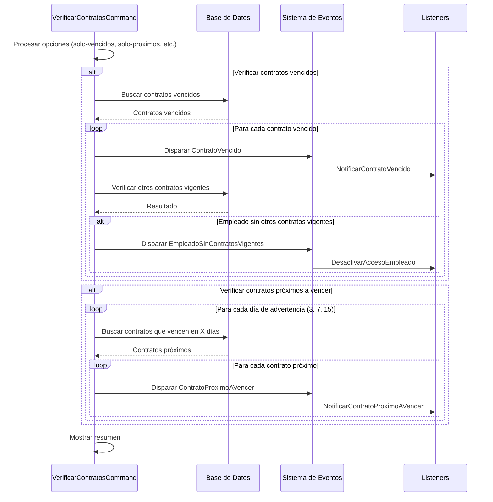

# Documentación: Comando para Verificar Contratos

## Descripción General

El comando `contratos:verificar` es una herramienta esencial del sistema de gestión de contratos que se encarga de:

1. Identificar contratos que han vencido (fecha de fin <= hoy)
2. Identificar contratos próximos a vencer (fecha de fin cercana a hoy)
3. Disparar los eventos correspondientes para cada situación
4. Verificar si los empleados con contratos vencidos tienen otros contratos vigentes

Este comando está diseñado para ejecutarse automáticamente mediante un cron job, pero también puede ejecutarse manualmente para pruebas o verificaciones específicas.

## Uso Básico

```bash
# Verificar todos los contratos (vencidos y próximos a vencer)
php artisan contratos:verificar

# Verificar solo contratos vencidos
php artisan contratos:verificar --solo-vencidos

# Verificar solo contratos próximos a vencer
php artisan contratos:verificar --solo-proximos

# Verificar contratos vencidos en los últimos 7 días
php artisan contratos:verificar --solo-vencidos --dias-retrasados=7
```

## Parámetros del Comando

| Opción                | Descripción                                      | Valor por defecto |
|-----------------------|--------------------------------------------------|-------------------|
| `--solo-vencidos`     | Verificar solo contratos vencidos                | false             |
| `--solo-proximos`     | Verificar solo contratos próximos a vencer       | false             |
| `--dias-retrasados=N` | Verificar contratos vencidos en los últimos N días | 1 día           |

## Eventos Disparados

El comando puede disparar los siguientes eventos:

| Evento                        | Condición                                    | Listener                         |
|-------------------------------|----------------------------------------------|----------------------------------|
| `ContratoVencido`             | Contrato con fecha_fin <= hoy                | `NotificarContratoVencido`       |
| `ContratoProximoAVencer`      | Contrato con fecha_fin cercana a hoy         | `NotificarContratoProximoAVencer`|
| `EmpleadoSinContratosVigentes`| Empleado sin contratos vigentes después de un vencimiento | `DesactivarAccesoEmpleado` |

## Funcionamiento Interno

### 1. Verificación de Contratos Vencidos

El comando busca contratos cuya fecha de fin sea menor o igual a la fecha actual:

```php
// Contratos vencidos
$contratos = Contrato::where('fecha_fin', '<=', Carbon::today())
    ->where('fecha_fin', '>=', Carbon::today()->subDays($diasRetrasados))
    ->with('empleado')
    ->get();

foreach ($contratos as $contrato) {
    event(new ContratoVencido($contrato));
    // Verificar si el empleado tiene otros contratos vigentes
    $otrosContratosVigentes = Contrato::where('empleado_id', $contrato->empleado_id)
        ->where('id', '!=', $contrato->id)
        ->where(function ($query) {
            $query->where('fecha_fin', '>=', Carbon::today())
                ->orWhereNull('fecha_fin');
        })->count();
    
    if ($otrosContratosVigentes === 0) {
        event(new EmpleadoSinContratosVigentes($contrato->empleado));
    }
}
```

### 2. Verificación de Contratos Próximos a Vencer

El comando identifica contratos que vencerán en los próximos días, específicamente en 3, 7 y 15 días:

```php
// Días de advertencia para contratos próximos a vencer
$diasAdvertencia = [3, 7, 15];

foreach ($diasAdvertencia as $dias) {
    $fechaProxima = Carbon::today()->addDays($dias);
    
    $contratos = Contrato::where('fecha_fin', $fechaProxima)
        ->with('empleado')
        ->get();
    
    foreach ($contratos as $contrato) {
        event(new ContratoProximoAVencer($contrato, $dias));
    }
}
```

## Configuración de Cron Job

Para que el comando se ejecute automáticamente, se debe configurar un cron job en el servidor:

```bash
# Ejecutar cada día a las 8:00 AM
0 8 * * * cd /ruta/a/proyecto && php artisan contratos:verificar >> /dev/null 2>&1
```

En Laravel, esto se puede configurar en el `app/Console/Kernel.php`:

```php
protected function schedule(Schedule $schedule)
{
    $schedule->command('contratos:verificar')->dailyAt('08:00');
}
```

## Flujo de Ejecución



## Pruebas y Verificación

Después de ejecutar el comando, se recomienda verificar:

1. Que los eventos se hayan disparado correctamente (logs, tablas de notificaciones)
2. Que las notificaciones se hayan enviado a los destinatarios correspondientes
3. Que el acceso de los empleados sin contratos vigentes haya sido revocado

## Consejos y Recomendaciones

1. **Ejecución manual inicial**: Ejecute el comando manualmente la primera vez para verificar su funcionamiento.
2. **Supervisión de cron**: Asegúrese de que el cron job está configurado correctamente y se ejecuta según lo programado.
3. **Logs detallados**: Active los logs detallados durante las pruebas para verificar cada paso del proceso.
4. **Pruebas con contratos reales**: Utilice el comando `contratos:crear-pruebas` para generar contratos de prueba con fechas específicas.
