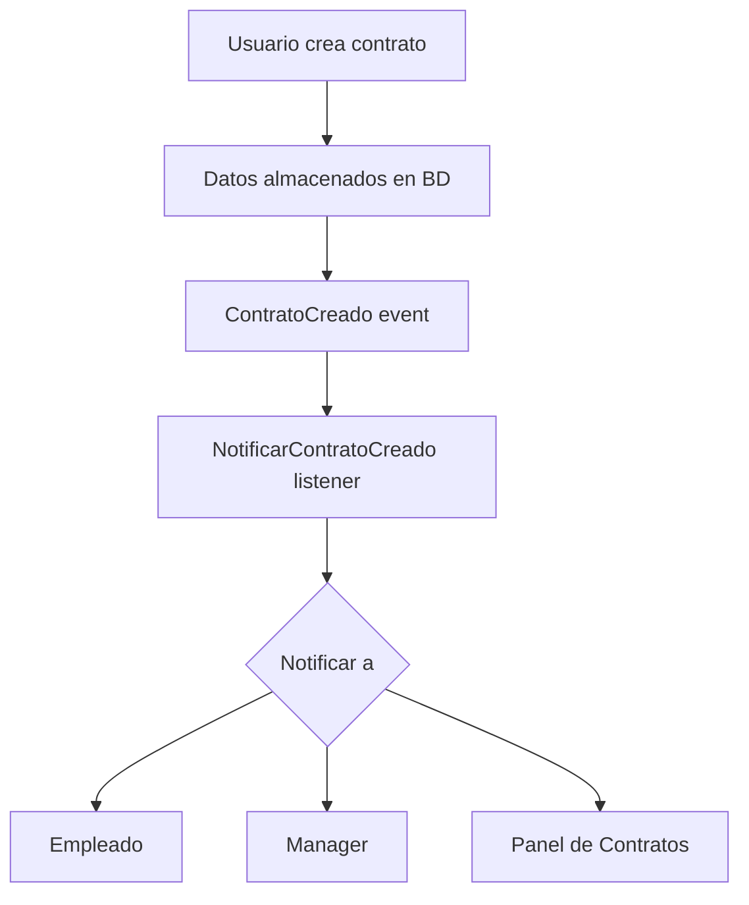
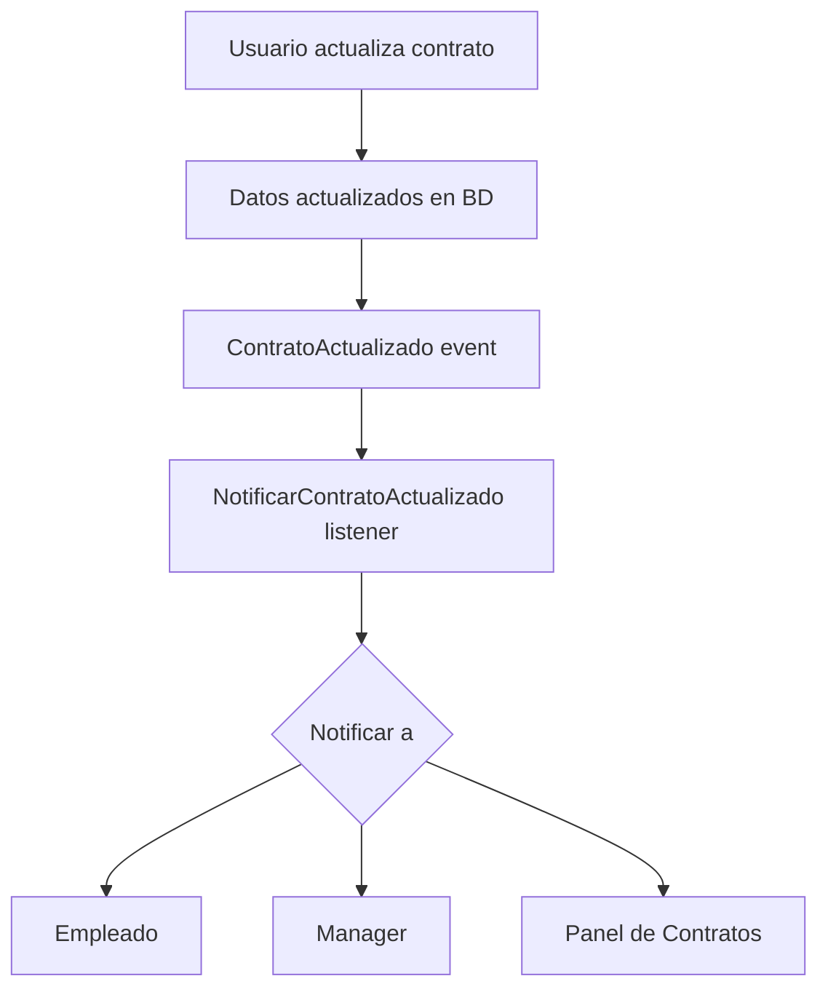
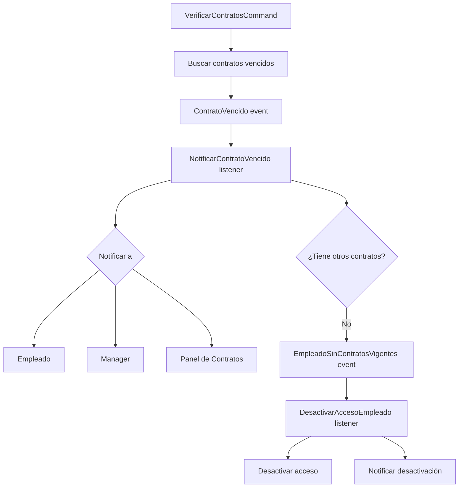
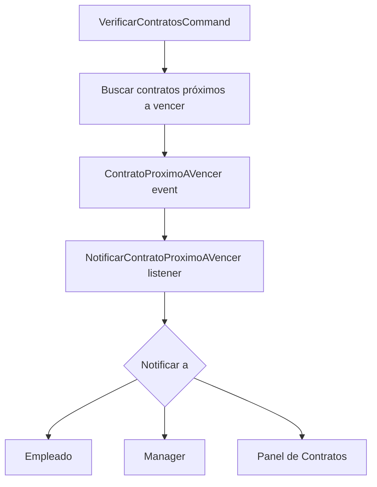
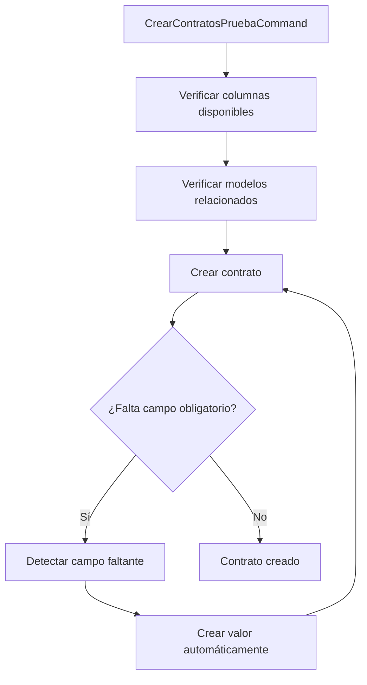

# Flujo de Trabajo del Sistema de Gestión de Contratos

## Ciclo de Vida de un Contrato

El sistema de gestión de contratos maneja el ciclo de vida completo de un contrato, desde su creación hasta su finalización, a través de diferentes eventos y notificaciones.

---

### 1. Creación de Contrato



**Flujo de datos:**

- Un usuario (generalmente de RRHH) crea un nuevo contrato.
- Los datos se almacenan en la base de datos.
- Se dispara el evento `ContratoCreado`.
- El listener `NotificarContratoCreado` envía notificaciones.
- Las notificaciones llegan al empleado, su manager y usuarios con permiso para ver el panel de contratos.

---

### 2. Actualización de Contrato



**Flujo de datos:**

- Un usuario actualiza un contrato existente.
- Los datos se actualizan en la base de datos.
- Se dispara el evento `ContratoActualizado`.
- El listener `NotificarContratoActualizado` envía notificaciones.
- Las notificaciones llegan a las partes interesadas.

---

### 3. Vencimiento de Contrato



**Flujo de datos:**

- El comando `VerificarContratosCommand` se ejecuta (programado o manualmente).
- Se identifican contratos que vencen hoy.
- Se dispara el evento `ContratoVencido` para cada contrato.
- El listener `NotificarContratoVencido` envía notificaciones.
- Se verifica si el empleado tiene otros contratos vigentes.
- Si no tiene otros contratos, se dispara `EmpleadoSinContratosVigentes`.
- El listener `DesactivarAccesoEmpleado` revoca el acceso del empleado al sistema.

---

### 4. Contratos Próximos a Vencer



**Flujo de datos:**

- El comando `VerificarContratosCommand` se ejecuta.
- Se identifican contratos próximos a vencer (15, 7 y 3 días).
- Se dispara el evento `ContratoProximoAVencer` para cada contrato.
- El listener `NotificarContratoProximoAVencer` envía notificaciones.
- Las notificaciones incluyen la cantidad de días restantes.

---

## Configuración de Cron Jobs

Para asegurar que las verificaciones se ejecuten automáticamente, el sistema está configurado para ejecutar el comando diariamente:

```bash
# Ejecutar cada día a las 8:00 AM
0 8 * * * cd /ruta/a/proyecto && php artisan contratos:verificar >> /dev/null 2>&1
```

---

## Parámetros del Comando de Verificación

El comando `contratos:verificar` puede ejecutarse con diferentes opciones:

| Opción               | Descripción                                 |
|----------------------|---------------------------------------------|
| `--solo-vencidos`    | Verificar solo contratos vencidos           |
| `--solo-proximos`    | Verificar solo contratos próximos a vencer  |
| `--dias-retrasados=N`| Verificar contratos vencidos en los últimos N días |

```bash
# Verificar contratos vencidos en la última semana
php artisan contratos:verificar --solo-vencidos --dias-retrasados=7
```

---

## Creación de Contratos de Prueba

Para facilitar las pruebas del sistema de notificaciones de vencimiento de contratos, se ha desarrollado un comando específico que permite crear contratos con fechas de vencimiento controladas:

```bash
# Crear un contrato que vence hoy
php artisan contratos:crear-pruebas --vence-hoy

# Crear un contrato que vence en 3 días (valor por defecto)
php artisan contratos:crear-pruebas --vence-pronto

# Crear un contrato que vence en 7 días
php artisan contratos:crear-pruebas --vence-pronto=7

# Crear un contrato que venció hace 5 días (valor por defecto)
php artisan contratos:crear-pruebas --vence-pasado

# Crear un contrato que venció hace 10 días
php artisan contratos:crear-pruebas --vence-pasado=10

# Crear todos los tipos de contratos de prueba
php artisan contratos:crear-pruebas --vence-hoy --vence-pronto=3 --vence-pasado=5
```

### Manejo de Campos Requeridos

El comando gestiona automáticamente todos los campos requeridos para los contratos:



El comando maneja automáticamente los siguientes campos obligatorios:
- `empleado_id`: Selecciona un empleado aleatorio existente
- `tipo_contrato_id`: Selecciona un tipo de contrato aleatorio
- `departamento_id`: Selecciona un departamento aleatorio
- `centro_id`: Selecciona un centro aleatorio
- `jornada_id`: Selecciona una jornada aleatoria
- `asignacion_id`: Obtiene o crea una asignación si es necesario
- `empresa_id`: Obtiene o crea una empresa si es necesario
- `n_expediente`: Genera un número de expediente único

Si durante la creación del contrato se detecta que falta un campo obligatorio, el sistema intentará crear automáticamente un valor válido para ese campo.

---

## Verificación del Funcionamiento

Para verificar que el sistema de gestión de contratos funciona correctamente, se pueden seguir estos pasos:

1. **Crear contratos de prueba**:
   ```bash
   php artisan contratos:crear-pruebas --vence-hoy --vence-pronto=3 --vence-pasado=5
   ```

2. **Verificar los contratos**:
   ```bash
   php artisan contratos:verificar
   ```

3. **Verificar las notificaciones**:
   - Revisar la tabla de notificaciones en la base de datos
   - Verificar que los correos electrónicos se hayan enviado (si está configurado)
   - Comprobar las notificaciones en tiempo real (si está utilizando broadcasting)

4. **Verificar desactivación de acceso**:
   - Asegurarse de que los empleados sin contratos vigentes no puedan acceder al sistema
   - Comprobar que los gestores recibieron notificaciones sobre la desactivación

Este proceso permite validar el flujo completo del sistema, desde la detección de contratos vencidos hasta la notificación a las partes interesadas y la desactivación de acceso cuando corresponda.
