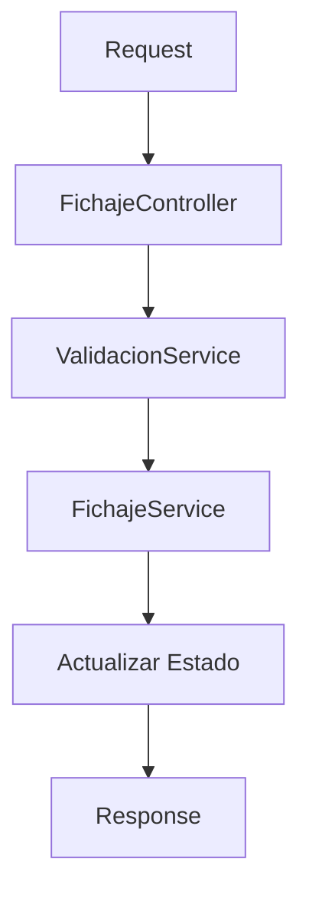
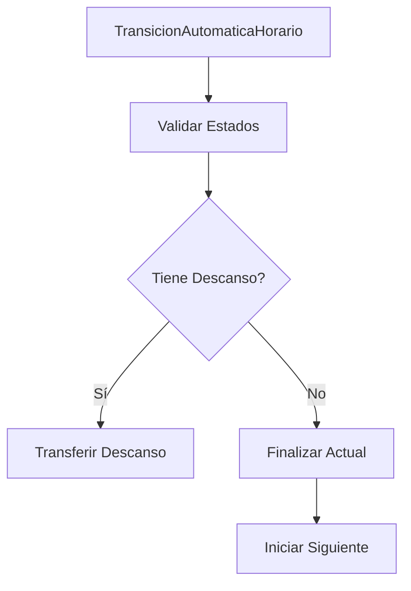
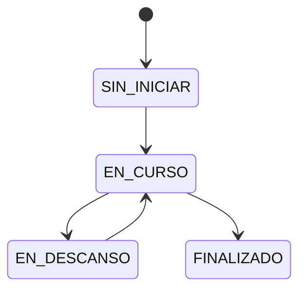

# Sistema de Fichaje - Documentación Técnica

## Índice
1. [Estructura del Sistema](#1-estructura-del-sistema)
2. [Flujos Principales](#2-flujos-principales)
3. [Casos de Uso](#3-casos-de-uso)
4. [API Endpoints](#4-api-endpoints)
5. [Manejo de Estados](#5-manejo-de-estados)
6. [Transiciones Automáticas](#6-transiciones-automáticas)

## 1. Estructura del Sistema

### 1.1 Controladores
```
app/Http/Controllers/API/v1/User/Fichaje/
├── FichajeController.php    # Acciones de fichaje
├── EstadoController.php     # Consulta de estados
```

### 1.2 Servicios
```
app/Services/Fichaje/
├── FichajeService.php      # Lógica principal
├── DescansoService.php     # Gestión de descansos
├── TransicionService.php   # Manejo de transiciones
└── ValidacionService.php   # Validaciones centralizadas
```

### 1.3 Jobs
```
app/Jobs/
└── TransicionAutomaticaHorario.php  # Transiciones entre horarios
```

## 2. Flujos Principales

### 2.1 Inicio de Fichaje


### 2.2 Transición entre Horarios


## 3. Casos de Uso

### 3.1 Descanso Obligatorio Normal
```
Horario: 8:00 - 15:00 (1 hora descanso)
1. 11:00 - Inicio descanso
2. 12:00 - Fin descanso
→ Tiempo correcto, sin excesos
```

### 3.2 Descanso Entre Horarios
```
H1: 8:00 - 15:00
H2: 15:00 - 22:00
1. 14:30 - Inicio descanso
2. 15:30 - Fin descanso
→ 30 min en H1
→ 30 min en H2
```

### 3.3 Transición Automática
```
H1: 8:00 - 15:00
H2: 15:00 - 22:00
1. 15:00 - Sistema detecta fin de H1
2. Sistema:
   - Finaliza H1
   - Inicia H2 automáticamente
   - Preserva estado de descansos
```

## 4. API Endpoints

### 4.1 Ejecutar Acción
```http
POST /api/v1/user/fichaje/accion
{
    "accion": "iniciar|finalizar|descanso|reanudar",
    "horario_id": 1,
    "coordenadas": {
        "latitud": 40.416775,
        "longitud": -3.703790
    }
}
```

### 4.2 Consultar Estado
```http
GET /api/v1/user/fichaje/estado
Response:
{
    "success": true,
    "data": {
        "horarios": [...],
        "estadisticas": [...],
        "permisos": {
            "puede_fichar": true,
            "puede_tomar_descanso": false
        }
    }
}
```

## 5. Manejo de Estados

### 5.1 Estados Posibles
```php
enum EstadoFichaje {
    case SIN_INICIAR;
    case EN_CURSO;
    case EN_DESCANSO;
    case FINALIZADO;
}
```

### 5.2 Transiciones Permitidas


## 6. Transiciones Automáticas

### 6.1 Proceso de Transición
```php
// Ejemplo de TransicionAutomaticaHorario
DB::transaction(function () {
    if ($descansoActivo) {
        $this->transferirDescanso($horarioActual, $horarioSiguiente);
    } else {
        $this->finalizarHorarioActual();
        $this->iniciarHorarioSiguiente();
    }
});
```

### 6.2 Validaciones
- Horario actual debe estar en curso
- Horario siguiente debe estar sin iniciar
- Horarios deben ser consecutivos
- Manejo de descansos activos

## 7. Consideraciones Importantes

1. **Zonas Horarias**
   - Todo el sistema trabaja en Europe/Madrid
   - Se permiten fichajes 30 minutos antes/después

2. **Descansos**
   - Obligatorios: Configurados por horario
   - Adicionales: Sin límite de tiempo
   - Transferibles entre horarios