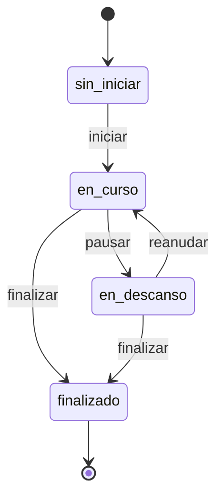

# Sistema de Fichaje

## Índice
1. [Descripción General](#descripción-general)
2. [Flujo de Estados](#flujo-de-estados)
3. [API](#api)
4. [Descansos](#descansos)
5. [Implementación Frontend](#implementación-frontend)
6. [Consideraciones Técnicas](#consideraciones-técnicas)

## Descripción General
Sistema de control de fichajes que permite gestionar entradas, salidas y descansos de empleados.

## Flujo de Estados

### Estados Posibles
- `sin_iniciar`: No se ha registrado entrada
- `en_curso`: Jornada iniciada
- `en_descanso`: En pausa
- `finalizado`: Jornada terminada

### Diagrama de Transiciones


### Reglas de Transición

| Estado Actual | Acción    | Estado Final | Validaciones |
|--------------|-----------|--------------|--------------|
| sin_iniciar  | iniciar   | en_curso    | - Dentro de horario (±30 min)<br>- Coordenadas válidas |
| en_curso     | pausar    | en_descanso | - No hay descanso activo<br>- Coordenadas válidas |
| en_descanso  | reanudar  | en_curso    | - Existe descanso activo<br>- Coordenadas válidas |
| en_curso     | finalizar | finalizado  | - Dentro de horario (±30 min)<br>- Coordenadas válidas |
| en_descanso  | finalizar | finalizado  | - Dentro de horario (±30 min)<br>- Coordenadas válidas |

## API

### Endpoints

#### GET /user/fichaje/estado
Obtiene el estado actual del fichaje.

**Respuesta Exitosa (200)**
```json
{
    "mensaje": "Estado del fichaje obtenido correctamente",
    "success_code": "200.1",
    "datos": {
        "hora_entrada": "08:00",
        "hora_salida": "23:59",
        "fecha_inicio": "2025-03-28",
        "fecha_fin": "2025-03-28",
        "descanso_inicio": "10:00",
        "descanso_fin": "10:30",
        "estado_fichaje": "sin_iniciar",
        "tiempo_restante": 55740
    }
}
```

#### POST /user/fichaje/accion
Maneja todas las acciones del fichaje.

**Request**
```javascript
{
    accion: 'iniciar', // 'iniciar' | 'pausar' | 'reanudar' | 'finalizar' || 'descanso'
    coordenadas: {
        latitud: 41.40338,
        longitud: 2.17403
    }
}
```

### Códigos de Respuesta

| Código | Descripción |
|--------|-------------|
| 200.1  | Operación exitosa |
| 404.1  | Usuario sin empleado o contrato |
| 404.2  | Sin horario asignado |
| 422.1  | Fuera de horario (antes) |
| 422.2  | Fuera de horario (después) |
| 500.1  | Error interno del servidor |

## Descansos

### Tipos de Descanso

#### Descanso Obligatorio
- Definido en el horario
- No se registra en BD
- Solo informativo
- Tiene un margen de tolerancia de 10 minutos
- Si se excede el margen, se registra automáticamente como descanso adicional

### Escenarios de Descansos

#### Tabla de Ejemplos

| Escenario | Hora Inicio | Hora Fin | Descanso Obligatorio | Resultado |
|-----------|-------------|-----------|---------------------|-----------|
| Descanso Normal | 10:30 | 11:00 | 14:00-15:00 | ✓ Un descanso adicional (10:30-11:00) |
| Antes del Obligatorio | 13:45 | 14:30 | 14:00-15:00 | ✓ Un descanso adicional (13:45-14:00) |
| Antes + Exceso | 13:45 | 15:30 | 14:00-15:00 | ✓ Dos descansos:<br>1. (13:45-14:00)<br>2. (15:10-15:30) |
| Durante Obligatorio | 14:15 | 14:45 | 14:00-15:00 | ✓ Sin registro (dentro del obligatorio) |
| Exceso del Obligatorio | 14:00 | 15:20 | 14:00-15:00 | ✓ Un descanso adicional (15:10-15:20) |

#### Ejemplos Detallados

1. **Descanso Normal**
   ```
   Horario: 8:00 - 17:00
   Descanso Obligatorio: 14:00 - 15:00
   Acción: Pausa 10:30 - 11:00
   Resultado: Se registra descanso adicional completo
   ```

2. **Descanso Antes del Obligatorio**
   ```
   Horario: 8:00 - 17:00
   Descanso Obligatorio: 14:00 - 15:00
   Acción: Pausa 13:45 - 14:30
   Resultado: Se registra solo la parte previa (13:45-14:00)
   ```

3. **Descanso con Exceso**
   ```
   Horario: 8:00 - 17:00
   Descanso Obligatorio: 14:00 - 15:00
   Acción: Pausa 13:45 - 15:30
   Resultado: 
   - Primer registro: 13:45 - 14:00
   - Segundo registro: 15:10 - 15:30 (exceso)
   ```

### Reglas de Registro

1. **Margen de Tolerancia**
   - 10 minutos después del fin del descanso obligatorio
   - No se registra descanso adicional dentro del margen

2. **Descansos Adicionales**
   - Se registran automáticamente
   - Requieren coordenadas válidas
   - Almacenan IP y User Agent
   - No puede haber más de uno activo

3. **Validaciones**
   - No se permite iniciar nuevo descanso con uno activo
   - Se requiere estado 'en_curso' para iniciar descanso
   - Se requiere estado 'en_pausa' para finalizar descanso

### Estructura de Datos
```php
{
    horario_id: number,
    descanso_inicio: datetime,
    descanso_fin: datetime|null,
    latitud_inicio: decimal,
    longitud_inicio: decimal,
    latitud_fin: decimal|null,
    longitud_fin: decimal|null,
    ip_address_inicio: string,
    ip_address_fin: string|null,
    user_agent_inicio: string,
    user_agent_fin: string|null
}
```

## Implementación Frontend

### Consumo de API
```javascript
// Obtener estado
const response = await axios.get(route('user.fichaje.estado'));

// Realizar acción
const response = await axios.post(route('user.fichaje.accion'), {
    accion: 'iniciar',
    coordenadas: {
        latitud: 41.40338,
        longitud: 2.17403
    }
});
```

### Interfaz según Estado
- `sin_iniciar`: Botón de inicio
- `en_curso`: Tiempo restante + botón de pausa
- `en_descanso`: Tiempo pausado + botón de reanudar
- `finalizado`: Resumen de jornada

## Consideraciones Técnicas

### Seguridad
- Validación de coordenadas geográficas
- Registro de IPs y User Agents
- Validaciones de horario estrictas
- Middleware de autenticación y verificación

### Rendimiento
- Cálculos de tiempo en segundos
- Actualizaciones periódicas del estado
- Caché de datos de usuario

### Mantenibilidad
- Eventos y listeners para acciones
- Logs detallados para debugging
- Validaciones centralizadas
- Tests automatizados