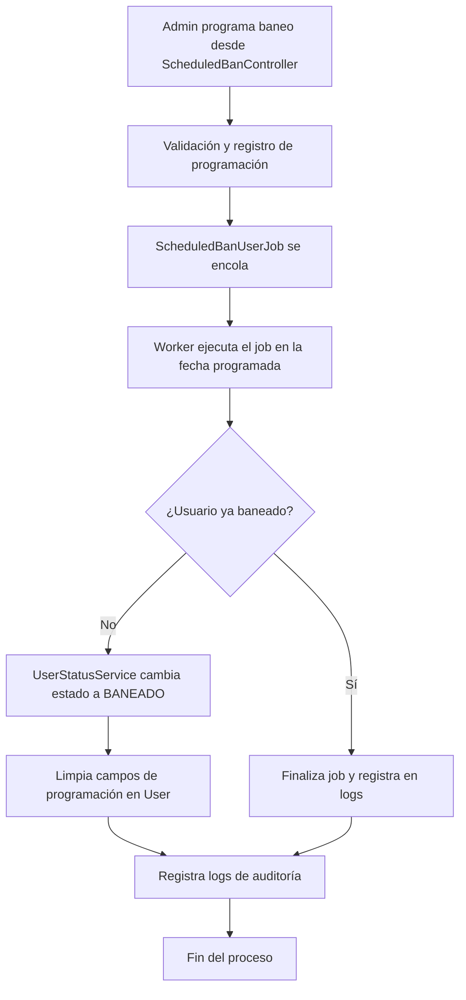

# Documentación Detallada de Baneos Programados, Jobs y Colas (Actualizada 2025)

Esta documentación describe en profundidad la arquitectura, lógica y flujo de trabajo de la funcionalidad de baneos programados, gestión de estados de usuario y el sistema de jobs/colas implementado en el proyecto.

---

## 1. ScheduledBanController.php                                                                                                                                                                                     

**Responsabilidad:**
Controlador principal para la gestión de baneos programados desde el panel de administración.

**Flujo y funciones:**
- `index()`: Muestra la vista de programación de baneos, recupera usuarios no baneados y sus datos de programación. Utiliza `UserStatusService` para mostrar etiquetas de estado legibles.
- `store(Request $request)`: Valida la solicitud (usuario, fecha, motivo), verifica que la fecha sea futura y que el usuario no esté ya baneado. Programa el job `ScheduledBanUserJob` para la fecha indicada (en entorno de pruebas, ejecuta en 1 minuto). Actualiza los campos `next_status`, `scheduled_status_change_at` y `scheduled_ban_reason` del usuario. Registra logs detallados para trazabilidad.
- `destroy(User $user)`: Permite cancelar un baneo programado, limpiando los campos de programación del usuario.

**Notas técnicas:**
- Usa Inertia para la vista y Carbon para fechas/zonas horarias.
- Registra logs para auditoría y depuración.

---

## 2. ScheduledBanUserJob.php

**Responsabilidad:**
Job encargado de ejecutar el baneo programado de un usuario.

**Propiedades y configuración:**
- `$timeout = 120`: Tiempo máximo de ejecución.
- `$tries = 3`: Número de reintentos.
- `$backoff = [30, 60, 120]`: Intervalos de espera entre reintentos.
- Cola: `default`.

**Métodos:**
- `__construct(User $user, string $reason, ?int $scheduledBy)`: Recibe usuario, motivo y admin que programa el baneo.
- `handle(UserStatusService $userStatusService)`: Refresca el usuario, verifica si ya está baneado, y si no, usa el servicio para cambiar el estado a "baneado". Limpia los campos de programación y registra logs de cada paso. Maneja errores y fallos.
- `failed(Throwable $exception)`: Registra en los logs si el job falla tras todos los intentos.

---

## 3. UserStatus.php

**Responsabilidad:**
Job para cambios programados de estado de usuario (activaciones, suspensiones, reactivaciones, etc.).

**Propiedades:**
- `$queue = 'user-status'`.
- `$timeout = 30`, `$tries = 3`, `$deleteWhenMissingModels = true`.

**Métodos:**
- `__construct(User $user, Status $newStatus, Carbon $scheduledAt)`: Recibe usuario, nuevo estado y fecha programada.
- `handle(UserStatusService $stateService)`: Si la fecha ya pasó, ejecuta el cambio de estado; si no, reprograma el job para la fecha correcta.
- `backoff()`: Intervalos de reintento.
- `failed(Throwable $exception)`: Maneja y registra fallos.

---

## Lógica detallada de UserStatus.php

`UserStatus.php` es un Job especializado en programar y ejecutar cambios de estado de usuario (no solo baneos, sino también activaciones, suspensiones, reactivaciones, etc.).

### Flujo de trabajo:
1. **Creación del Job:**
   - Se instancia con el usuario objetivo, el nuevo estado y la fecha/hora programada para el cambio.
2. **Ejecución (`handle`)**:
   - Si la fecha programada ya pasó, ejecuta el cambio de estado inmediatamente usando `UserStatusService`.
   - Si aún no es tiempo, reprograma el job para la fecha correcta usando `self::dispatch(...)->delay(...)`.
3. **Reintentos y fallos:**
   - Define intervalos de reintento (`backoff`) y número de intentos (`tries`).
   - Si el job falla tras todos los intentos, ejecuta el método `failed` para registrar el error.

### Ejemplo de uso:
- Permite programar suspensiones automáticas por permisos, reactivaciones tras ausencias, o cualquier transición de estado futura.
- El sistema puede lanzar este job desde servicios como `UserStatusService` mediante el método `scheduleStatusChange`.

### Ventajas:
- Centraliza la lógica de cambios de estado programados.
- Permite trazabilidad y control de errores.
- Facilita la extensión para nuevos tipos de estados o reglas de negocio.

---

## 4. TestJob.php

**Responsabilidad:**
Job de pruebas para cambios de estado de usuario, útil para testear la cola y la lógica de cambios programados.

**Propiedades:**
- `$tries = 3`, `$timeout = 30`, `$failOnTimeout = true`.
- Cola: `user-status-queue`.

**Métodos:**
- `__construct(User $user, UserStatus $newStatus, DateTime $scheduledAt)`.
- `handle()`: Cambia el estado del usuario, limpia la programación y registra logs. Usa transacciones para asegurar la integridad.
- `failed(Throwable $exception)`: Registra el fallo en los logs.

---

## 5. UserStatusService.php

**Responsabilidad:**
Servicio centralizado para la gestión de estados de usuario.

**Funciones principales:**
- `changeUserStatus(User $user, UserStatus $newStatus)`: Cambia el estado, limpia la programación y fuerza cierre de sesión si es baneo. Elimina sesiones si el usuario es baneado y el driver de sesión es `database`. Registra logs y limpia caché.
- `checkUserLeaveRequestStatus(User $user, Carbon $datein, Carbon $dateout)`: Gestiona el estado del usuario en función de permisos y ausencias.
- `scheduleStatusChange(User $user, UserStatus $nextStatus, Carbon $scheduledAt)`: Programa un cambio de estado futuro, creando un job en la cola correspondiente.

---

## 6. Configuración y soporte

- **`config/queue.php`:** Define conexiones de cola (`database`, `user-status`, etc.), tablas y drivers. Permite separar los jobs por tipo y prioridad.
- **`database/migrations/0001_01_01_000002_create_jobs_table.php`:** Crea las tablas `jobs`, `failed_jobs` y `job_batches` para el manejo de colas y fallos.
- **Comandos personalizados (`QueueMonitor.php`):** Permite monitorizar en tiempo real el estado de las colas y jobs desde consola. Muestra estadísticas, últimos jobs y jobs fallidos en tiempo real.

---

## 7. Últimos avances y mejoras (2025)

- Se ha documentado y estandarizado el flujo de programación y ejecución de baneos.
- Se ha añadido un comando de monitorización en tiempo real (`queue:monitor-live`) para facilitar la supervisión de colas y jobs.
- Se han mejorado los logs y la trazabilidad de los cambios de estado y baneos.
- Se ha optimizado la gestión de reintentos y fallos en los jobs críticos.
- Se ha añadido un diagrama de flujo visual para comprender el ciclo completo de un baneo programado.

---

## Diagrama de flujo general del sistema de baneos programados y jobs



---

## Lógica de estados de usuario (`UserStatus` enum y uso en jobs)

### Enum `UserStatus`
El enum `UserStatus` define los posibles estados de un usuario en el sistema:
- `INACTIVE` (0): Inactivo
- `ACTIVE` (1): Activo
- `SUSPENDED` (2): Suspendido
- `PENDING` (3): Pendiente
- `BANNED` (4): Baneado

Incluye el método `label()` para obtener una representación legible del estado, útil para mostrar en interfaces y logs.

### Uso en jobs y recursos
- Los jobs como `UserStatus.php` y `ScheduledBanUserJob.php` utilizan este enum para establecer y consultar el estado de los usuarios de forma tipada y segura.
- En recursos como `UserStatusResource.php`, se transforma el valor numérico del estado a su nombre o etiqueta legible para exponerlo en APIs o vistas.

#### Ejemplo de transformación en recurso:
```php
// ...existing code...
'status' => UserStatus::from($this->status)->name,
// ...existing code...
```

### Ventajas de la lógica
- Centraliza la definición de estados y evita errores de valores mágicos.
- Permite extender fácilmente el sistema con nuevos estados o etiquetas.
- Facilita la internacionalización y la presentación coherente en toda la aplicación.

---

**Documentación generada automáticamente por GitHub Copilot.**
